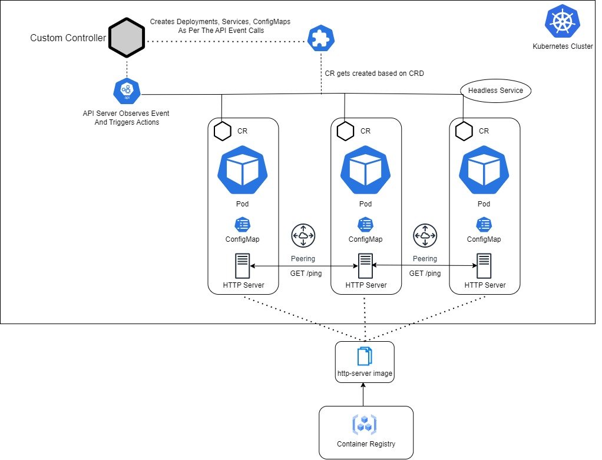

# http-go-operator

The Kubernetes operator is designed to manage a containerized application using the `measutosh/http-server` image. The operator creates and manages a deployment of this container, which utilizes a configmap specific to the operator. The configmap contains a list of destination hosts and ports to which the server sends periodic requests. The server expects a "ping" response from these destinations and logs the received responses on the client side. The operator ensures the proper deployment, configuration, and monitoring of this application within the Kubernetes cluster.

- The server code is here - [https://github.com/measutosh/peering-http-server](https://github.com/measutosh/peering-http-server)
- Server Image Is Here - `measutosh/http-server`
- Controller Image Is Here - `measutosh/http-go-operator` 


# Custom Controller for KindCustomHttp Resource

This repository contains a custom controller implementation for managing the `KindCustomHttp` resource in a Kubernetes cluster. The controller creates and maintains a deployment, service, and config map based on the specifications provided in the `KindCustomHttp` custom resource.

## Architecture Diagram

The following diagram illustrates the architecture and flow of the controller:




## Controller Functionality

The `KindCustomHttpReconciler` implements the following functionality:

- **Reconcile**: This function is invoked when there are changes or events related to the `KindCustomHttp` resource. It performs the necessary operations to create, update, or delete the deployment, service, and config map based on the provided specifications.

- **Create Deployment**: Creates a new deployment based on the `KindCustomHttp` resource specifications. It ensures the desired number of replicas and sets up the necessary container and volume configurations.

- **Create Service**: Creates a service for the HTTP server defined in the deployment. The service exposes the specified port and forwards traffic to the HTTP container.

- **Create ConfigMap**: Creates a config map based on the `ConfigMapData` provided in the `KindCustomHttp` resource. The config map is mounted as a volume in the deployment, allowing the HTTP server to access the configuration data.

## Controller Flow

The controller follows the following flow when reconciling the `KindCustomHttp` resource:

1. Receive an event for the `KindCustomHttp` resource.
2. Retrieve the `KindCustomHttp` resource and existing deployment, service, and config map objects.
3. If the `KindCustomHttp` resource is not found, no action is taken.
4. If the `KindCustomHttp` resource is deleted, check if the deployment or service needs to be deleted.
5. If the deployment exists, check if the number of replicas needs to be updated.
6. If the service exists, check if the port needs to be updated.
7. If the config map exists, check if the data needs to be updated.
8. If any of the resources need to be created, updated, or deleted, perform the corresponding operations.
9. Return the result of the reconciliation.


### Running on the cluster
1. Install Instances of Custom Resources:

```sh
kubectl apply -f config/samples/
```

2. Build and push your image to the location specified by `IMG`:

```sh
make docker-build docker-push IMG=<some-registry>/http-go-operator:tag
```

3. Deploy the controller to the cluster with the image specified by `IMG`:

```sh
make deploy IMG=<some-registry>/http-go-operator:tag
```

### Uninstall CRDs
To delete the CRDs from the cluster:

```sh
make uninstall
```

### Undeploy controller
UnDeploy the controller from the cluster:

```sh
make undeploy
```

## How to test it
// TODO(user): Add detailed information on how you would like others to contribute to this project

### How it works
This project aims to follow the Kubernetes [Operator pattern](https://kubernetes.io/docs/concepts/extend-kubernetes/operator/).

It uses [Controllers](https://kubernetes.io/docs/concepts/architecture/controller/),
which provide a reconcile function responsible for synchronizing resources until the desired state is reached on the cluster.

### Test It Out
1. Install the CRDs into the cluster:

```sh
make install
```

2. Run your controller (this will run in the foreground, so switch to a new terminal if you want to leave it running):

```sh
make run
```

**NOTE:** You can also run this in one step by running: `make install run`

### Modifying the API definitions
If you are editing the API definitions, generate the manifests such as CRs or CRDs using:

```sh
make manifests
```


# stimulated-peering
