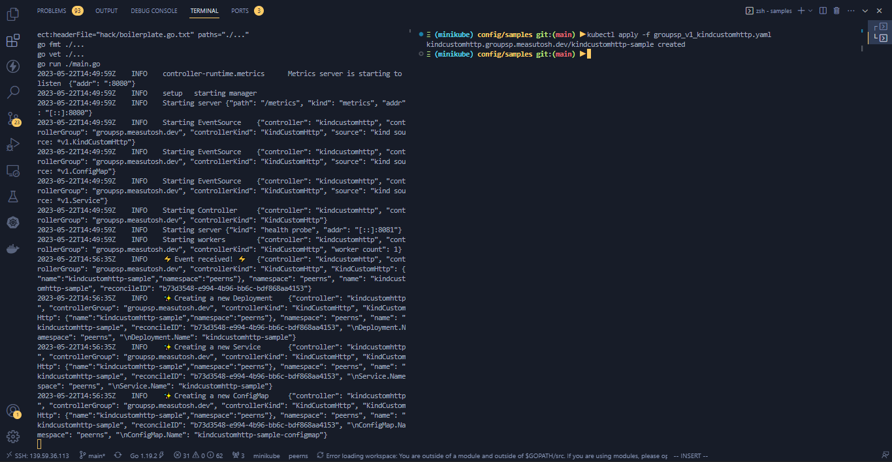

# stimulated-peering

The `http-go-operator` Kubernetes operator is designed to manage a containerized application using the `measutosh/http-server` image. The operator creates and manages a deployment of this container, which utilizes a configmap specific to the operator. The configmap contains a list of destination hosts and ports to which the server sends periodic requests. The server expects a "ping" response from these destinations and logs the received responses on the client side. The operator ensures the proper deployment, configuration, and monitoring of this application within the Kubernetes cluster.

- The server code is here - [https://github.com/measutosh/peering-http-server](https://github.com/measutosh/peering-http-server)
- Server Image Is Here - `measutosh/http-server`
- Controller Image Is Here - `measutosh/http-go-operator` 


# Custom Controller for KindCustomHttp Resource

This repository contains a custom controller implementation for managing the `KindCustomHttp` resource in a Kubernetes cluster. The controller creates and maintains a deployment, service, and config map based on the specifications provided in the `KindCustomHttp` custom resource.

## Architecture Diagram

The following diagram illustrates the architecture and flow of the controller:


## Controller Functionality

The `KindCustomHttpReconciler` implements the following functionality:

- **Reconcile**: This function is invoked when there are changes or events related to the `KindCustomHttp` resource. It performs the necessary operations to create, update, or delete the deployment, service, and config map based on the provided specifications.

- **Create Deployment**: Creates a new deployment based on the `KindCustomHttp` resource specifications. It ensures the desired number of replicas and sets up the necessary container and volume configurations.

- **Create Service**: Creates a service for the HTTP server defined in the deployment. The service exposes the specified port and forwards traffic to the HTTP container.

- **Create ConfigMap**: Creates a config map based on the `ConfigMapData` provided in the `KindCustomHttp` resource. The config map is mounted as a volume in the deployment, allowing the HTTP server to access the configuration data.

## Controller Flow

The controller follows the following flow when reconciling the `KindCustomHttp` resource:

1. Receive an event for the `KindCustomHttp` resource.
2. Retrieve the `KindCustomHttp` resource and existing deployment, service, and config map objects.
3. If the `KindCustomHttp` resource is not found, no action is taken.
4. If the `KindCustomHttp` resource is deleted, check if the deployment or service needs to be deleted.
5. If the deployment exists, check if the number of replicas needs to be updated.
6. If the service exists, check if the port needs to be updated.
7. If the config map exists, check if the data needs to be updated.
8. If any of the resources need to be created, updated, or deleted, perform the corresponding operations.
9. Return the result of the reconciliation.


## How to test it locally

- To run it locally you need to have few things installed
    - Go 1.20 or Any version after that
    - Kubernetes Cluster
    - Kubectl
    - Operator-SDK

> If you don't want to mess up your cluster then spin up a k8s environment in KillerKoda and run the commands to install everything and make a simple quick setup

<br>

### GO

```sh
curl -LO https://go.dev/dl/go1.20.4.linux-amd64.tar.gz
rm -rf /usr/local/go && tar -C /usr/local -xzf go1.20.4.linux-amd64.tar.gz
export PATH=$PATH:/usr/local/go/bin
go version
```

### KUBECTL

```sh
curl -LO "https://dl.k8s.io/release/$(curl -L -s https://dl.k8s.io/release/stable.txt)/bin/linux/amd64/kubectl"
sudo install -o root -g root -m 0755 kubectl /usr/local/bin/kubectl
kubectl version --short
```


### Operator-SDK

```sh
export ARCH=$(case $(uname -m) in x86_64) echo -n amd64 ;; aarch64) echo -n arm64 ;; *) echo -n $(uname -m) ;; esac)
export OS=$(uname | awk '{print tolower($0)}')

export OPERATOR_SDK_DL_URL=https://github.com/operator-framework/operator-sdk/releases/download/v1.28.1
curl -LO ${OPERATOR_SDK_DL_URL}/operator-sdk_${OS}_${ARCH}

gpg --keyserver keyserver.ubuntu.com --recv-keys 052996E2A20B5C7E

curl -LO ${OPERATOR_SDK_DL_URL}/checksums.txt
curl -LO ${OPERATOR_SDK_DL_URL}/checksums.txt.asc
gpg -u "Operator SDK (release) <cncf-operator-sdk@cncf.io>" --verify checksums.txt.asc

grep operator-sdk_${OS}_${ARCH} checksums.txt | sha256sum -c -

chmod +x operator-sdk_${OS}_${ARCH} && sudo mv operator-sdk_${OS}_${ARCH} /usr/local/bin/operator-sdk

operator-sdk version
```


## To see it in actions follow the steps

- Clone this repo to your local and enter into it
- Run the following commands to setup the controller with proper reconciliation logic

```sh
git clone https://github.com/measutosh/stimulated-peering.git
cd stimulated-peering/
make manifests
make generate
make install run
```


- Keep the operator running and open another terminal to the side and apply the deployment manifest within the namespace `peerns`

```sh
kubectl create ns peerns
kubectl config set-context --current --namespace=peerns
cd ./config/samples
kubectl apply -f groupsp_v1_kindcustomhttp.yaml 
```

- After applying the maniests, you should see in the other side operator will kick up the steps to create deployments, services and configmaps




## **Few commands to try out to know the features**

<br>

### **Updating the resources as per the changes in CRD, Deployment, Service, ConfigMap**

- If you modify the details(**parameters under `specs` key**) inside the deployment file, the controller will observer and will implement the respective changes. These changes can be any tipe such as: if pod got deleted by mistake then create again or don't create etc. In this case, if something new comes up, the controller adds it and if something gets removed then the controller removes it.


<br>


<br>

### **Simillarly if you change port or configmap also in the deployment file it will get triggerred and implement the relevant changes**

<br> 


<br>


###  **Connection Between Pods**

- **All the pods can connect to each other and will respond if a ping request is sent to the address -  `<pod-ip>:8080/ping`** 

```sh
kubectl exec -it <source-pod-name>  -n peerns -- curl <destination-pod-ip>:8080/ping
```


- **All the pods sends ping requests to a list of servers within an interval of 30sec no stop, collects the log in the output also. To check this you can see the logs of any of the pods.**


```sh
kubectl logs pod/<pod-name>
```


- **If the configmap gets updated, the pod gets a config refresh and the servers get the fresh list of host and ports. Following which the ping requests to list of hosts also change.**

- _Below two servers are getting hit by the provided pod._


- **When you change the configmap `hostports` key in the deployment file, the response will also change. This change may take some time reflect as the go routine will take some time to fetch the fresh config and the kubernetes volume cache also takes it's time. So wait for a minute and you should see the change.**


> Once done, run the following to clear the lab setup


_**ctr + c => to stop the controller**_

_**Run below commands to clear the resources which were created**_
```sh

kubectl delete -f ./config/samples/groupsp_v1_kindcustomhttp.yaml
kubectl delete deployment.apps/kindcustomhttp-sample service/kindcustomhttp-sample  configmap/kindcustomhttp-sample-configmap
```
